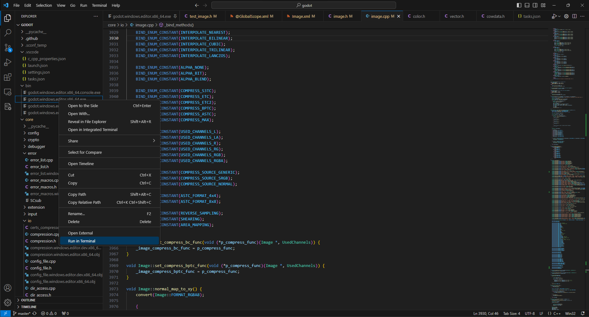
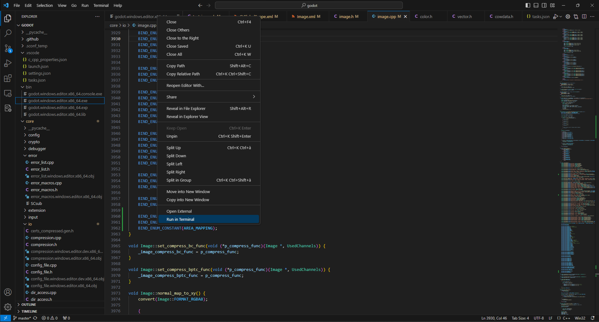
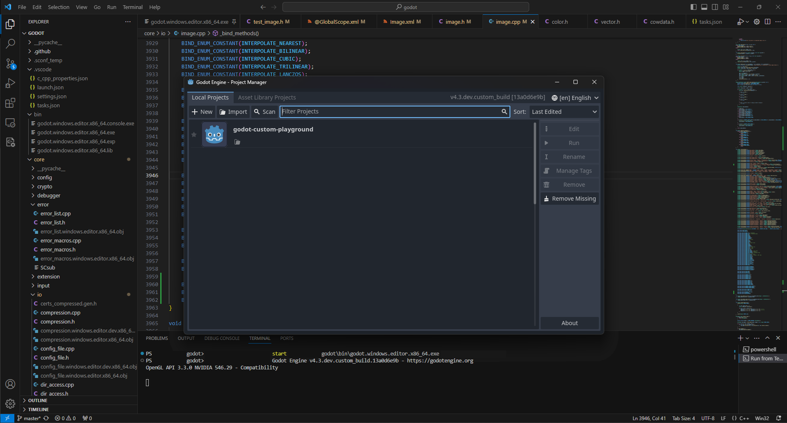
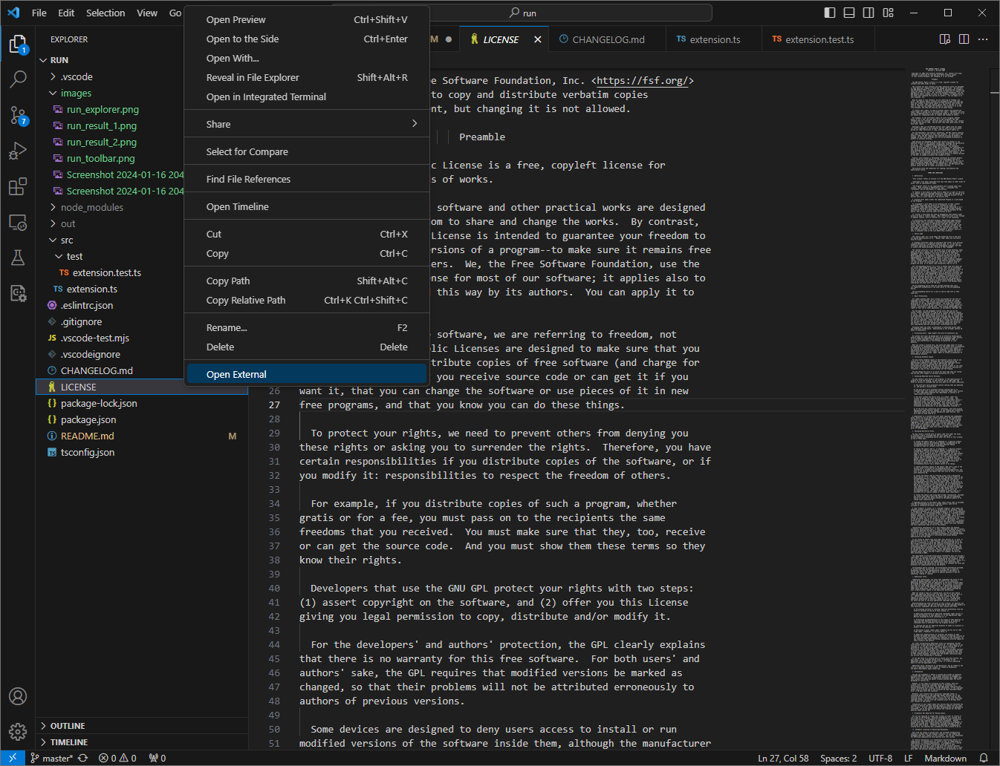
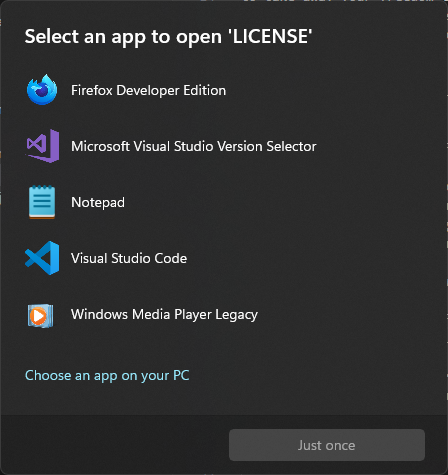

# run 

[ext-url]: https://marketplace.visualstudio.com/items?itemName=hcommand.run-runner
[][ext-url]
[][ext-url]
[][ext-url]

VSCode extension to run executables directly from the Explorer.

## Features

This extension provides different ways of running files:
- Run in Terminal: Creates a new Terminal, and starts the executable file. On Windows, only allows starting .exe files. There are no file type limitations for other platforms.
- Open External: Opens the file with the preffered external program. If the file is executable, will launch it.

You can run files like this in two different ways:
- From the File Explorer
- In the opened files toolbar

## Examples
You can access the new options from the explorer right-click menu:

Or from the toolbar of opened files:

After selecting the `Run in Terminal` option, a new terminal will be opened, and your program will start:

The `Open External` option is avaiable for all file types on all OSs. It allows you to open the selected file in a seperate app:

The file will be opened in the OS's preffered app for the file, and if no app is selected, you will be promted to select one (if it's runnable or an app itself, it will launch):

